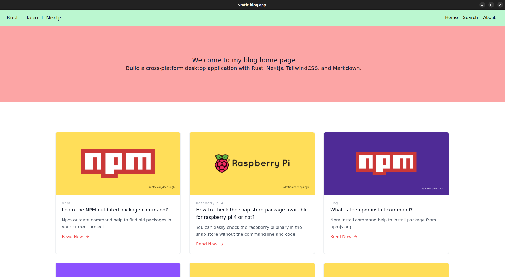

# Tauri + Next.js
Static Blog is a desktop-based application built with Tauri and Next.js.

## Note
Before building your application in tauri with nextjs, run ESLint configuration `pnpm lint` to remove all errors. Then run `pnpm tauri`.

## Start development server
To start the development server, run `pnpm tauri dev` command in the terminal.

## Build your application
To build the application, run `pnpm tauri` build command in the terminal.

## Build your snap or snap store application
To build the application, run `pnpm tauri-snap` build command in the terminal.

## Build your snapcraft application
To build the application, run `snapcraft` build command in the terminal.

#### Note
- With a rust toolchain, you build cross-application.
- Currently, I not find ways to resolve the Appimage and flatpak.

[VS Code](https://code.visualstudio.com/) + [Tauri](https://marketplace.visualstudio.com/items?itemName=tauri-apps.tauri-vscode) + [rust-analyzer](https://marketplace.visualstudio.com/items?itemName=rust-lang.rust-analyzer)
